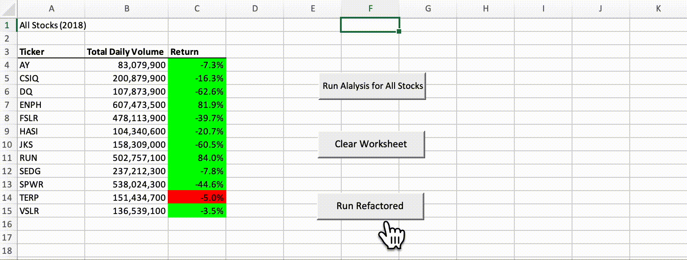

# Green Stock Analysis

### Project Overview

Steve has asked me to analyze a green stock for his parents to see if they should invest in it.  To do this, I used VBA in Excel to find the stocks total daily volume and the annual return. In the data provided there were additional stocks to compare with to see how the stock performed.  This comparison provided the best option on which stock to invest in.

### Purpose 

The purpose of this project was to find and use an efficent way of reviewing data from multiple stocks in VBA.  The initial code ran and produced the correct data.  However, there was a way to revise (refactor) the code to have it run in less time and become more efficient.  Although this project used 12 stocks refactoring code can be helpful with larger sets of data that can take more time to process.  

## Results

## Refactoring the Code

To make my code more efficient I needed to change the way code was nested within my loops by creating arrays.  Four arrays were created to achieve this; tickers, tickerVolumes, tickerStartingPrices, and tickerEndingPrices.  The tickers array was used to establish the ticker symbol of the stock and the variable called tickerIndex was used with the other three arrays. The variable TickerIndex was assigned to tickerVolumes, tickerStartingPrices, and tickerEndingPrices for each ticker symbol before running throught the set of data. This allows the data to be compiled faster than using the nested loop in the original code.

### Original Code

Sub AllStocksAnalysis()

Dim startTime As Single
Dim endTime As Single

yearValue = InputBox("What year would you like to run the analysis on?")

    startTime = Timer
    

'1) Format the output sheet on the "All Stocks Analysis" worksheet.

Worksheets("All Stocks Analysis").Activate

    Range("A1").Value = "All Stocks (" + yearValue + ")"

        'Create a header row
        Cells(3, 1).Value = "Ticker"
        Cells(3, 2).Value = "Total Daily Volume"
        Cells(3, 3).Value = "Return"
        
'2) Initialize an array of tickers

Dim tickers(12) As String

tickers(0) = "AY"
tickers(1) = "CSIQ"
tickers(2) = "DQ"
tickers(3) = "ENPH"
tickers(4) = "FSLR"
tickers(5) = "HASI"
tickers(6) = "JKS"
tickers(7) = "RUN"
tickers(8) = "SEDG"
tickers(9) = "SPWR"
tickers(10) = "TERP"
tickers(11) = "VSLR"

'3a)Initialize the variables for the starting price and the ending price.

Dim startingPrice As Single
Dim endingPrice As Single

'3b) Activate the worksheet containing the data.

Sheets(yearValue).Activate

'3c)Find the number of rows to loopover

RowCount = Cells(Rows.Count, "A").End(xlUp).Row

'4) Loop through the tickers.

For i = 0 To 11

    ticker = tickers(i)
    Totalvolume = 0
    
    '5a) Loop through rows in the data.
    
        Sheets(yearValue).Activate
        For j = 2 To RowCount
        
        '5b) Find total volume for the current ticker.
        If Cells(j, 1).Value = ticker Then
        
            Totalvolume = Totalvolume + Cells(j, 8).Value
    
        End If
    
        '5c) Find starting price for the current ticker.
        If Cells(j - 1, 1).Value <> ticker And Cells(j, 1).Value = ticker Then
    
            startingPrice = Cells(j, 6).Value
        
        End If
    
        '5d)Find ending price for the current ticker.
        If Cells(j + 1, 1).Value <> ticker And Cells(j, 1).Value = ticker Then
    
            endingPrice = Cells(j, 6).Value
        
        End If
    
    Next j
    
    
'6) Output the data for the current ticker.

    Worksheets("All Stocks Analysis").Activate
    Cells(4 + i, 1).Value = ticker
    Cells(4 + i, 2).Value = Totalvolume
    Cells(4 + i, 3).Value = endingPrice / startingPrice - 1
    
Next i

    endTime = Timer
    MsgBox " This code ran in " & (endTime - startTime) & " seconds for the year " & (yearValue)
    

End Sub

### Refactored Code

Sub AllStocksAnalysisRefactored()
    Dim startTime As Single
    Dim endTime  As Single
    
    yearValue = InputBox("What year would you like to run the analysis on?")
    
    startTime = Timer
    
    'Format the output sheet on All Stocks Analysis worksheet
    Worksheets("All Stocks Analysis").Activate
    Range("A1").Value = "All Stocks (" + yearValue + ")"
    
    'Create a header row
    Cells(3, 1).Value = "Ticker"
    Cells(3, 2).Value = "Total Daily Volume"
    Cells(3, 3).Value = "Return"
    
    'Initialize array of all tickers
    Dim tickers(12) As String
    tickers(0) = "AY"
    tickers(1) = "CSIQ"
    tickers(2) = "DQ"
    tickers(3) = "ENPH"
    tickers(4) = "FSLR"
    tickers(5) = "HASI"
    tickers(6) = "JKS"
    tickers(7) = "RUN"
    tickers(8) = "SEDG"
    tickers(9) = "SPWR"
    tickers(10) = "TERP"
    tickers(11) = "VSLR"
    
    'Activate data worksheet
    Worksheets(yearValue).Activate
    
    'Get the number of rows to loop over
    RowCount = Cells(Rows.Count, "A").End(xlUp).Row
    
    '1a) Create a ticker Index. Set to zero before looping through rows

    Dim tickerIndex As Single
    tickerIndex = 0
   
    '1b) Create three output arrays
    Dim tickerVolumes(12) As Long
    Dim tickerStartingPrices(12) As Single
    Dim tickerEndingPrices(12) As Single
    
    '2a) Create a for loop to initialize the tickerVolumes to zero. The tickerIndex is used to access the stock tickers, ticker starting prices, and ending prices
    Worksheets(yearValue).Activate
    For i = 0 To 11
    tickerVolumes(i) = 0
    tickerStartingPrices(tickerIndex) = 0
    tickerEndingPrices(tickerIndex) = 0
    Next i
    
    ''2b) Loop over all the rows in the spreadsheet.
    For j = 2 To RowCount
    
        '3a) Increase volume for current ticker. Will shift the tickerIndex to next ticker if it doesn't match the previous row’s ticker.
    
            tickerVolumes(tickerIndex) = tickerVolumes(tickerIndex) + Cells(j, 8).Value
    
        
        '3b) Check if the current row is the first row with the selected tickerIndex.
        If Cells(j - 1, 1).Value <> tickers(tickerIndex) And Cells(j, 1).Value = tickers(tickerIndex) Then
            'Store starting price value
            tickerStartingPrices(tickerIndex) = Cells(j, 6).Value
        End If
        
        '3c) check if the current row is the last row with the selected ticker
         'If the next row’s ticker doesn’t match, increase the tickerIndex.
        If Cells(j + 1, 1).Value <> tickers(tickerIndex) And Cells(j, 1).Value = tickers(tickerIndex) Then
            'Store ending price Value
            tickerEndingPrices(tickerIndex) = Cells(j, 6).Value
    
            tickerIndex = tickerIndex + 1
        End If
        
        Next j
        
    '4) Loop through your arrays to output the Ticker, Total Daily Volume, and Return. Formatting the output for arrays.
        Worksheets("All Stocks Analysis").Activate
        For i = 0 To 11
        tickerIndex = i
        Cells(4 + i, 1).Value = tickers(tickerIndex)
        Cells(4 + i, 2).Value = tickerVolumes(tickerIndex)
        Cells(4 + i, 3).Value = tickerEndingPrices(tickerIndex) / tickerStartingPrices(tickerIndex) - 1
        
        'Fix percentage on return
        With Range("C4:C15")
            .NumberFormat = "0.0%"
            .Value = .Value
        End With
        
        Next i
        
    'Formatting
    Worksheets("All Stocks Analysis").Activate
    Range("A3:C3").Font.FontStyle = "Bold"
    Range("A3:C3").Borders(xlEdgeBottom).LineStyle = xlContinuous
    Range("B4:B15").NumberFormat = "#,##0"
    Range("C4:C15").NumberFormat = "0.0%"
    Columns("B").AutoFit
    dataRowStart = 4
    dataRowEnd = 15
    
    For i = dataRowStart To dataRowEnd
        If Cells(i, 3) > 0 Then
            Cells(i, 3).Interior.Color = vbGreen
        Else
            Cells(i, 3).Interior.Color = vbRed
        End If
    Next i
    
    endTime = Timer
    MsgBox " This code ran in " & (endTime - startTime) & " seconds for the year " & (yearValue)
End Sub

## Run Time Videos for Original Code

### 2017

### 2018

## Run Time Videos for Refactored Code

### 2017

### 2018

According to the results the refactored run times are faster and therefore more efficient.

## Summary of Refactoring

### General Thoughts on Refactoring

The advantage of refactoring is that it can make your code more efficient and and run much quicker.  The downfall is that in doing this you can potentially take a code that runs and creates the desired outputs and make it a mess if you are unacle to correctly rewrite the code.  I advise that you always save the original code before refactoring.  A lesson I learned the hard way!

### Refactoring in VBA Script

The biggest advantage that I noticed is that it is very easy to see your original code and refactored code side by side.  You can also easily copy/paste your original code into a new module to refactor.  You can also easily run through your code to see if it runs and it will identify where there are errors.  If you do not have an understanding of what the error codes mean though it can be a disadvantage cause it introduces problems with the code that ran just fine before you refactored.  
